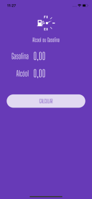

# alcool_gasolina
 Projeto implementado em Flutter / Dart para calcular o preço do combustivel
 
 

# App Alcool ou Gasolina
 Aplicativo exibe personagens da `Marvel` (foto/nome/descrição) onde é possível adiciona-los como favorito.
 
  ### Projeto desenvolvido ultilizando:
  - [x] Flutter SDK
  - [x] MVU
  - [x] Animation
  - [x] Android / iOS
  
 ## Print Screen :foggy:
 
|  |
|:---:|
| App Alcool Gasolina | 
